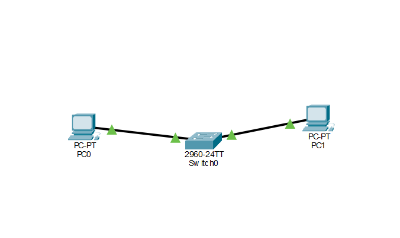

# Network Fundamentals — Basic LAN Configuration

## Objective

Configure two computers on the same IPv4 network using a Cisco switch and verify connectivity between the hosts.

## Lab Environment

- Cisco Packet Tracer
- 2 × PCs
- 1 × Cisco 2960 switch
- IPv4

## Network Topology

## IP Configuration

| Device | IP Address | Subnet Mask |
|---|---|---|
| PC0 | 192.168.1.10 | 255.255.255.0 |
| PC1 | 192.168.1.20 | 255.255.255.0 |

Both hosts belong to the `192.168.1.0/24` network.

## Connectivity Test

From PC0, I tested connectivity to PC1 using: ping 192.168.1.20

The ping was successful, demonstrating that both hosts could communicate through the switch.

## Troubleshooting Exercise

I changed PC1's IP address to: 192.168.2.20

The ping from PC0 then failed.

## Explanation

PC0 was configured on: 192.168.1.0/24

while PC1 was configured on: 192.168.2.0/24

These are different networks. Because the lab contained only a Layer 2 switch and no router, there was no device available to route traffic between the two networks.

I restored PC1 to 192.168.1.20, and connectivity was successfully restored.

This lab helped me understand how IP addresses and subnet masks determine whether two hosts are on the same network. I also learned that a switch provides connectivity within a LAN, while communication between different IP networks requires routing.
