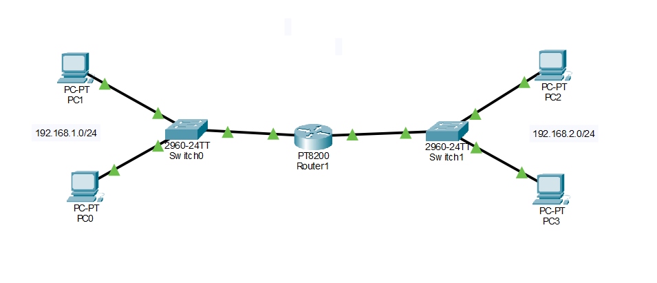

# Lab 2 — Routing Between Two Networks

## Objective

Configure a router to allow communication between two separate IPv4 networks.

## Lab Environment

- Cisco Packet Tracer
- 1 × PT8200 Router
- 2 × Cisco 2960-24TT switches
- 4 × PCs
- IPv4

## Network Topology

## Network Design

This lab contains two separate networks.

### Network 1

- Network: `192.168.1.0/24`
- Router interface: `192.168.1.1`

### Network 2

- Network: `192.168.2.0/24`
- Router interface: `192.168.2.1`

The router provides connectivity between the two networks.

## IP Configuration

| Device | IP Address | Subnet Mask | Default Gateway |
|---|---|---|---|
| PC0 | 192.168.1.10 | 255.255.255.0 | 192.168.1.1 |
| PC1 | 192.168.1.20 | 255.255.255.0 | 192.168.1.1 |
| PC2 | 192.168.2.10 | 255.255.255.0 | 192.168.2.1 |
| PC3 | 192.168.2.20 | 255.255.255.0 | 192.168.2.1 |

## Router Configuration

The router was configured with an interface in each network.

### Interface 1

- IP Address: 192.168.1.1
- Subnet Mask: 255.255.255.0

### Interface 2

- IP Address: 192.168.2.1
- Subnet Mask: 255.255.255.0

### Connectivity Testing

I tested communication between devices using ping.

Example:

PC0 → PC2
192.168.1.10 → 192.168.2.10

Because PC2 is on a different network, PC0 sends the traffic to its default gateway: 192.168.1.1

The router then forwards the traffic toward 192.168.2.10

### What I Learned

This lab demonstrated how a router connects different IP networks.

I learned that a switch provides connectivity between devices within a local network, while a router is required to forward traffic between different networks.

I also learned that the default gateway is used when a device needs to communicate with a destination outside its local network.

