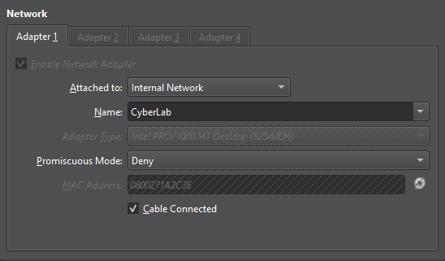
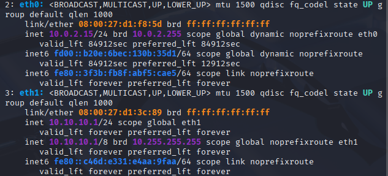
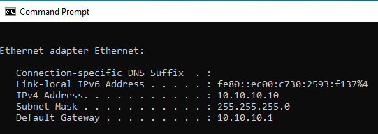
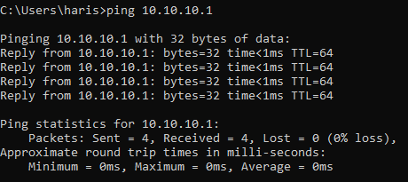
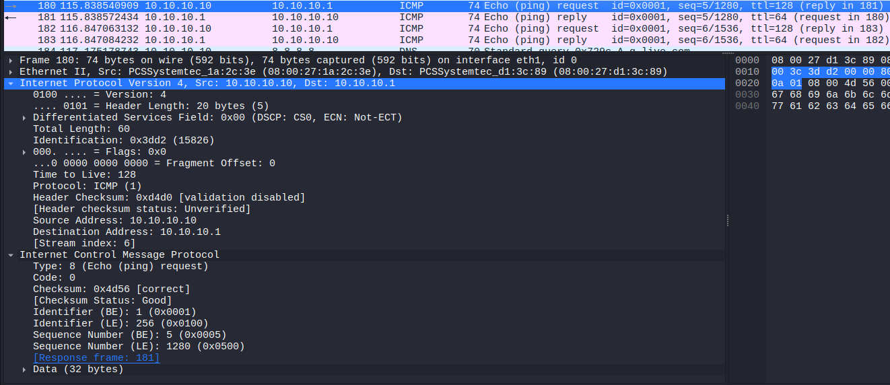
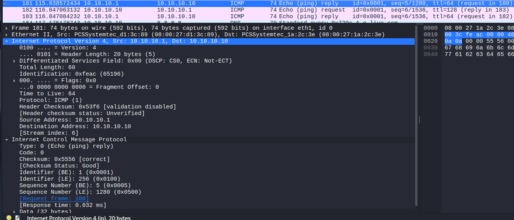

# Lab 3 — Kali Linux & Windows Virtual Network

## Objective

Build an isolated virtual network between Kali Linux and Windows 10 using VirtualBox and prepare the environment for network traffic analysis with Wireshark.

## Environment

- VirtualBox
- Kali Linux 2025.2
- Windows 10
- Wireshark

## Network Topology

```text
             Internet
                │
               NAT
                │
        ┌───────┴───────┐
        │     Kali      │
        │               │
        │ eth0          │
        │ 10.0.2.15/24  │
        │               │
        │ eth1          │
        │ 10.10.10.1/24 │
        └───────┬───────┘
                │
          CyberLab LAN
          10.10.10.0/24
                │
        ┌───────┴───────┐
        │   Windows 10  │
        │ 10.10.10.10/24│
        └───────────────┘
```

## Virtual Network Configuration

### Kali Linux

| Interface | Network | IP Address |
|---|---|---|
| eth0 | NAT | 10.0.2.15/24 |
| eth1 | CyberLab | 10.10.10.1/24 |


### Windows 10

| Interface | Network | IP Address |
|---|---|---|
| Ethernet | CyberLab | 10.10.10.10/24 |



## Configuration

Kali's internal interface was configured with:

10.10.10.1/24



Windows was configured with:

10.10.10.10/24



### Connectivity Testing

Connectivity was tested from Windows using:
```bash
ping 10.10.10.1
```



The test successfully returned ICMP Echo Replies.

## Wireshark Analysis

Wireshark was used on Kali to capture ICMP traffic generated by the Windows VM.


ICMP Echo Request:
Source:      10.10.10.10
Destination: 10.10.10.1


ICMP Echo Reply:
Source:      10.10.10.1
Destination: 10.10.10.10

The capture showed:

- Echo Request = Windows is asking Kali whether it is reachable.
- Echo Reply = Kali is responding to Windows.
- Source IP = the machine sending the packet.
- Destination IP = the machine receiving the packet.

## Key Findings

- Kali and Windows were placed on the isolated `CyberLab` network.
- Kali used `eth1` as its internal network interface.
- Windows successfully communicated with Kali using ICMP.
- Wireshark captured the ICMP Echo Request and Echo Reply packets.
- The packet source and destination addresses matched the configured IP addresses.

## Troubleshooting

No significant connectivity issues were encountered during the final configuration.

The Kali internal interface initially used a `/8` prefix. I changed it to `/24` so that the CyberLab network was configured consistently as `10.10.10.0/24`.
