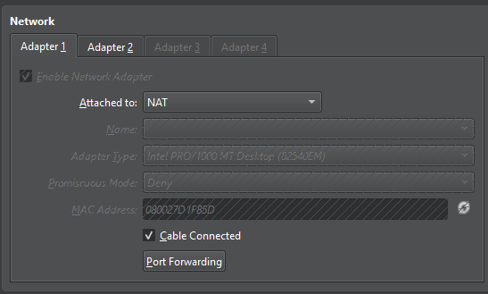
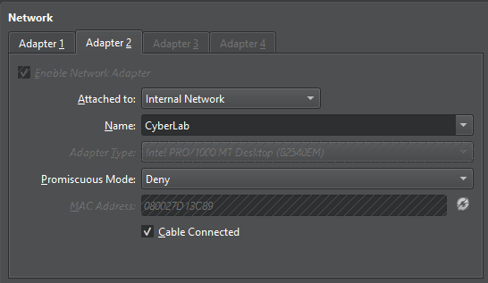

# Lab 3 — Kali Linux & Windows Virtual Network

## Objective

Build an isolated virtual network between Kali Linux and Windows 10 using VirtualBox and prepare the environment for network traffic analysis with Wireshark.

## Environment

- VirtualBox
- Kali Linux 2025.2
- Windows 10
- Wireshark

## Network Topology

             Internet
                │
               NAT
                │
        ┌───────┴───────┐
        │     Kali      │
        │               │
        │ eth0          │
        │ 10.0.2.15     │
        │               │
        │ eth1          │
        │ 10.10.10.1    │
        └───────┬───────┘
                │
          CyberLab LAN
                │
        ┌───────┴───────┐
        │ Windows 10  │
        │ 10.10.10.10   │
        └───────────────┘

## Virtual Network Configuration

### Kali Linux

| Interface | Network | IP Address |
|---|---|---|
| eth0 | NAT | 10.0.2.15/24 |
| eth1 | CyberLab | 10.10.10.1/24 |

### Windows 10

| Interface | Network | IP Address |
|---|---|---|
| Ethernet | CyberLab | 10.10.10.10/24 |

## Configuration

Kali's internal interface was configured with:
10.10.10.1/24

Windows was configured with:
10.10.10.10/24

### Connectivity Testing

Connectivity was tested from Windows using:
ping 10.10.10.1

The test successfully returned ICMP Echo Replies.
