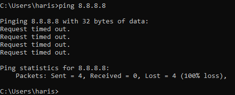

# Lab 3 - Configure Kali as a Gateway

## Objective 

Configure Kali Linux to act as a Gateway for Windows so that Kali can forward traffic from Windows to Kali's NAT interface.

## Environment

- VirtualBox
- Kali Linux 2025.2
- Windows 10
- Wireshark

## Kali as Gateway

```text
        Windows
      10.10.10.10
           │
           │ CyberLab
           ↓
        Kali eth1
      10.10.10.1
           │
           │ Kali routes/NATs traffic
           ↓
        Kali eth0
      10.0.2.15
           │
           ↓
      VirtualBox NAT
           │
           ↓
        Internet
```

## Step 1 - Enable IP Forwarding

Kali was configured to forward IPv4 traffic between its network interfaces.

Command used:

```bash
sudo sysctl -w net.ipv4.ip_forward=1
```
Result: 1

This allows Kali to route IPv4 traffic between the CyberLab interface (eth1) and the NAT interface (eth0).

## Step 2 - Initial Connectivity Test

Testing routing using Windows.

```bash
ping 8.8.8.8
```


The ping test timed out and failed.

NAT was not configured; Windows could reach Kali but could not reach the Internet.

Windows → Kali      ✅
Windows → 8.8.8.8   ❌

This demonstrated that IP forwarding alone was not sufficient for Windows to access the Internet through Kali.

