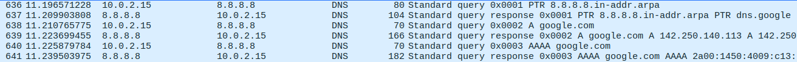
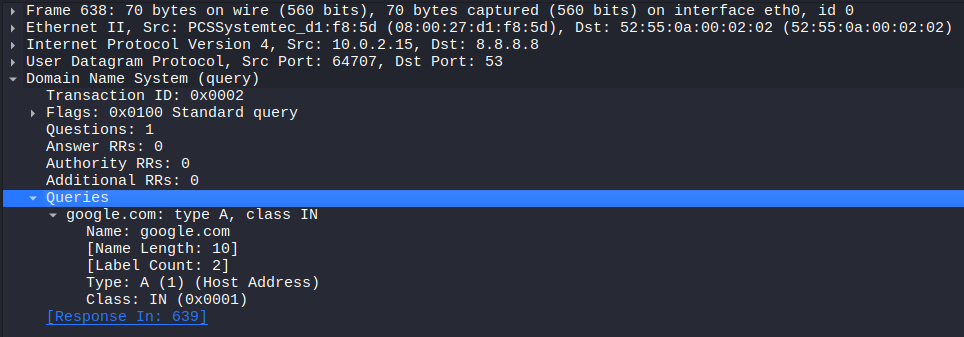
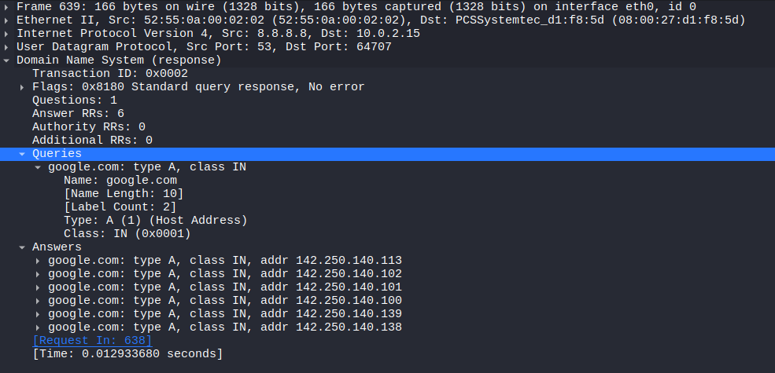

# Lab 5 – DNS Fundamentals & Investigation

## Objective
Understand DNS resolution and analyse a real DNS query/response using
Wireshark, now that Lab 4 fixed routing/NAT.

## Environment
- Kali: eth0 10.0.2.15 / eth1 10.10.10.1
- Windows 10 client: 10.10.10.10, using DNS server 8.8.8.8

## DNS Lookup
```bash
nslookup google.com 8.8.8.8
```


Returned multiple IPv4 and IPv6 addresses for google.com.

## Wireshark Analysis
Captured on Kali's eth0 interface, filter: `dns`



### **The query (packet 638):**
- 10.0.2.15 -> 8.8.8.8, source port 64707, destination port 53
- Transaction ID: 0x0002
- Question: google.com, type A



### **The response (packet 639):**
- 8.8.8.8 -> 10.0.2.15, source port 53, destination port 64707
- Transaction ID: 0x0002 (matches the query)
- Flags: "No error" — lookup succeeded
- Answer RRs: 6 — six IP addresses came back, matching the nslookup output
- Round-trip time: 0.0129 seconds (13ms)



## What I Learned
- The Transaction ID is what matches a response to its question. This
  matters in security because attackers try to fake/guess this ID to
  trick a computer into accepting a fake answer (DNS spoofing).
- The source port changes with every new query, but the reply always
  comes back to that exact port so the client knows which request it
  answers.
- A DNS response can carry several answers at once — Google returns 6
  IPs for redundancy/load balancing.
