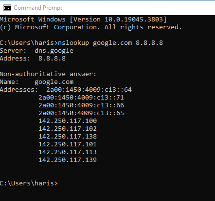

# Lab 5 – DNS Fundamentals & Investigation

## Objective
Understand DNS resolution and analyse a real DNS query/response using
Wireshark, now that Lab 4 fixed routing/NAT.

## Environment
- Kali: eth0 10.0.2.15 / eth1 10.10.10.1
- Windows 10 client: 10.10.10.10, using DNS server 8.8.8.8

## DNS Lookup
```bash
nslookup google.com 8.8.8.8
```


Returned multiple IPv4 and IPv6 addresses for google.com.

## Wireshark Analysis
