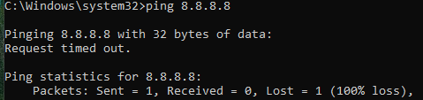
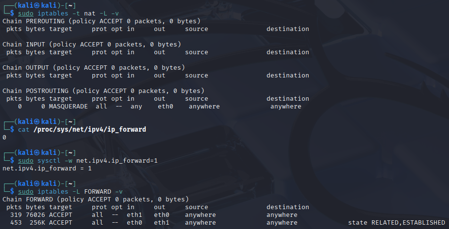
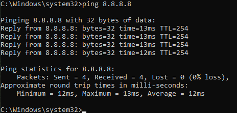
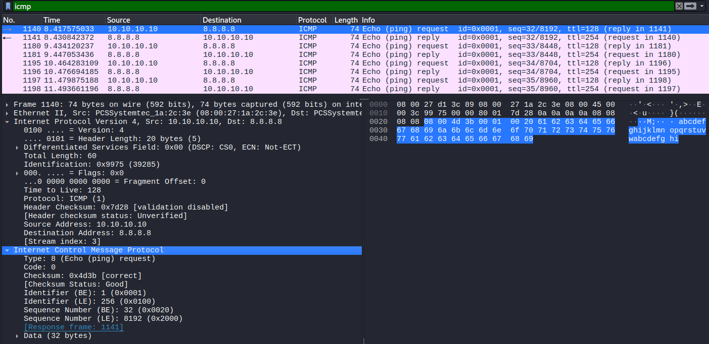
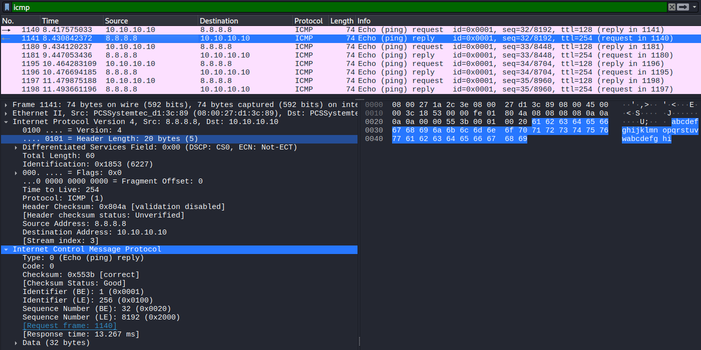

# Lab 6 – ICMP Packet Analysis

## Objective
Capture and understand a ping (ICMP) request/reply pair in Wireshark.

## Setup
- Kali: eth1 10.10.10.1 (capture point)
- Windows 10 client: 10.10.10.10
- Target: 8.8.8.8

## Troubleshooting: connectivity broke before this lab

Before starting the ICMP capture, DNS lookups had stopped working again
after a reboot.

Checked in order:

    ping 10.10.10.1               -> worked (Kali reachable)
    ping 8.8.8.8                   -> worked (internet reachable)
    nslookup google.com 8.8.8.8    -> timed out

Since general internet access worked but DNS specifically didn't,
check the forwarding/NAT state on Kali:

    cat /proc/sys/net/ipv4/ip_forward
    sudo iptables -t nat -L -v
    sudo iptables -L FORWARD -v

The NAT rule and FORWARD rules had survived the reboot, which was a bit
surprising, but confirmed the general lesson: `ip_forward` and iptables
rules aren't guaranteed to persist across a reboot unless made
permanent. Re-checked/re-applied the settings, and connectivity returned
before moving on to the ICMP capture below.

## The Ping
Ran this on Windows:

    ping 8.8.8.8

## Wireshark Capture
Captured on Kali's eth1 interface, filter: `icmp`

### Request Ping

**The request (packet 1140):**
- 10.10.10.10 -> 8.8.8.8
- Type: 8 (Echo request)
- TTL: 128
- Identifier: 0x0001
- Sequence number: 32

### Reply Ping

**The reply (packet 1141):**
- 8.8.8.8 -> 10.10.10.10
- Type: 0 (Echo reply)
- TTL: 254
- Same identifier and sequence number as the request

## What I Learned
- iptables rules and ip_forward can reset on reboot unless saved
  permanently (e.g. with iptables-persistent) — worth checking after
  every reboot, not just assuming the setup still holds.
- The same bottom-up check (ping by IP -> ping the target -> then DNS)
  isolates which layer is actually broken, instead of guessing.
- Type 8 = request, type 0 = reply. That single number is how a device
  tells a ping request apart from a ping reply.
- Identifier + sequence number work like DNS's transaction ID — they
  let a device match each reply to the exact request it sent, especially
  useful when several pings are in flight at once (sequence number goes
  up by one each time: 32, 33, 34...).
- TTL can hint at what OS sent a packet. Windows starts at 128; Linux
  usually starts at 255 (arrived here as 254 after one hop).
