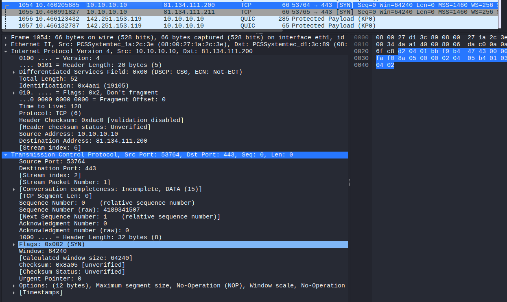
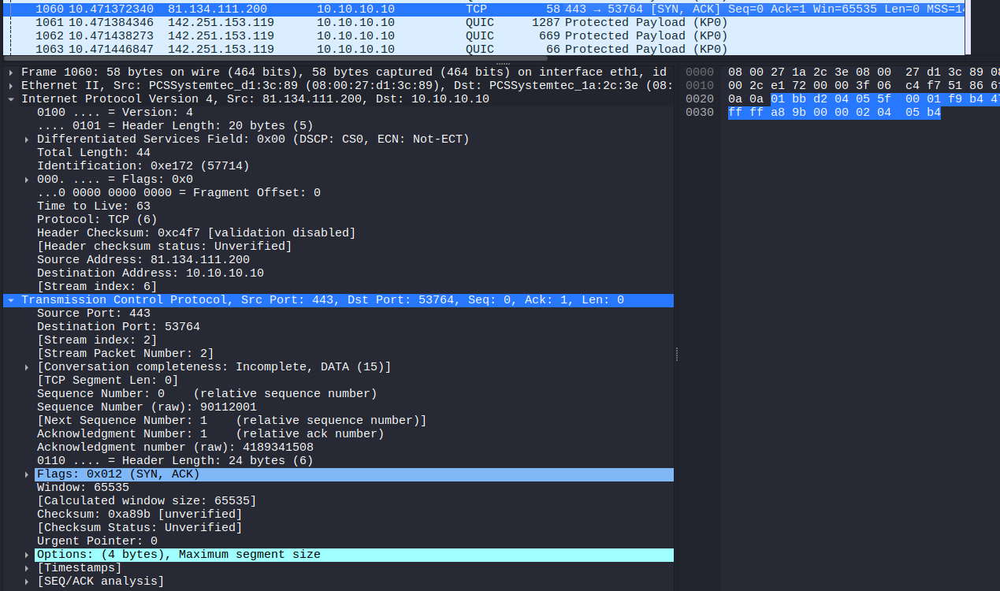
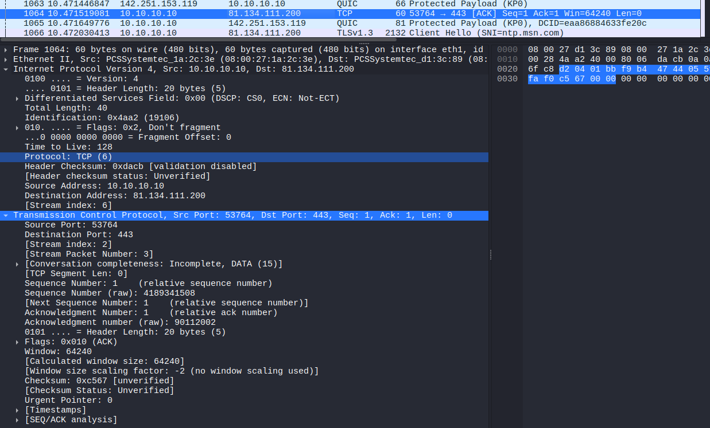

# Lab 8 – TCP Three-Way Handshake

## Objective
Capture and understand how a TCP connection is established.

## Setup
- Kali: eth1 10.10.10.1 (capture point)
- Windows 10 client: 10.10.10.10
- Target: google.com (81.134.111.200), port 443

## The Test
Ran this on Windows:

    Test-NetConnection google.com -Port 443

## Wireshark Capture
Captured on Kali's eth1 interface, filter: `tcp`

**1. SYN (packet 1054)** — 10.10.10.10 -> 81.134.111.200
- Src Port: 53764, Dst Port: 443
- Sequence Number (raw): 4189341507
- Flags: SYN

**2. SYN, ACK (packet 1060)** — 81.134.111.200 -> 10.10.10.10
- Src Port: 443, Dst Port: 53764
- Sequence Number (raw): 90112001
- Acknowledgment Number (raw): 4189341508 (client's seq + 1)
- Flags: SYN, ACK

**3. ACK (packet 1064)** — 10.10.10.10 -> 81.134.111.200
- Sequence Number (raw): 4189341508
- Acknowledgment Number (raw): 90112002 (server's seq + 1)
- Flags: ACK

After the handshake completed, the next packet was a TLS Client Hello —
the actual HTTPS conversation starting on top of the now-established
TCP connection.

## What I Learned
- Each side picks its own random starting sequence number — this
  randomness matters for security, since a predictable sequence number
  is what lets an attacker hijack or inject into a TCP connection.
- "Acknowledging" a sequence number means replying with that number + 1
  — this is how each side confirms what it received.
- SYN, SYN-ACK, ACK — after these three packets, real data (in this
  case, TLS) can start flowing.
- Wireshark's "relative sequence number" view (starting each stream
  at 0) makes conversations easier to read, but the raw numbers are the
  ones actually on the wire.
