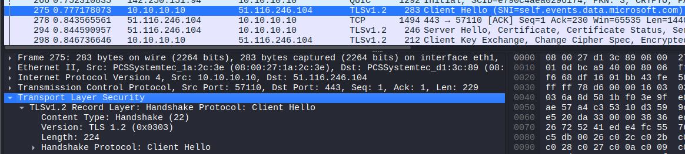
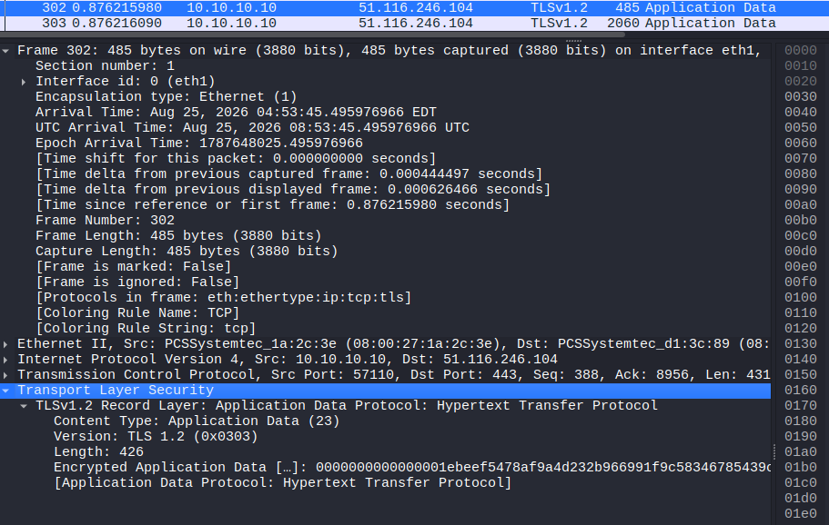

# Lab 10 – HTTP vs HTTPS

## Objective
Compare a plaintext HTTP capture (Lab 8) against an HTTPS capture to see
exactly what encryption hides and what it doesn't.

## Setup
- Kali: eth1 10.10.10.1 (capture point)
- Windows 10 client: 10.10.10.10

## Troubleshooting: lab environment broke after resuming saved VMs
Before this lab, Kali and Windows could no longer ping each other after
being reopened from a saved state (this had worked fine at the end of
the previous session).

Checked, in order: interface state (ip a / ipconfig), Windows firewall
profile (found set to Public, switched to Private), and the VirtualBox
network adapter attachment on both VMs.

None of these fully resolved it. What worked was fully shutting down
and restarting both VMs instead of resuming from a saved state.

Lesson: VirtualBox's saved-state feature does not reliably restore
internal network adapter state. A full shutdown/restart is more
reliable for a multi-VM lab like this one, even though it's slower.

## Wireshark Capture
Captured on Kali's eth1 interface, filter: `tls`

**Client Hello (packet 275):**
- TLS 1.2, Handshake Protocol: Client Hello
- SNI (Server Name Indication): self.events.data.microsoft.com
- The destination domain is visible even before encryption starts

**Application Data (packet 302):**
- Content Type: Application Data
- Payload shown only as encrypted hex, e.g.:
  0000000000000001ebeef5478af9a4d232b966991f9c58346785439...
- Compared to Lab 8, where the same kind of packet showed a full
  readable "GET / HTTP/1.1" request with headers.

## What I Learned
- TLS encrypts the actual conversation (method, headers, URL, page
  content) but not everything — the SNI field reveals which domain was
  contacted, in plain text, during the handshake.
- analyst can often see *who* talked to *whom* over HTTPS,
  but not *what* was said, unless they can decrypt it
  (e.g. with TLS session keys).
- Saved VM state is not a reliable way to pause a multi-VM lab
  environment — full shutdown/restart avoids silent network issues.
