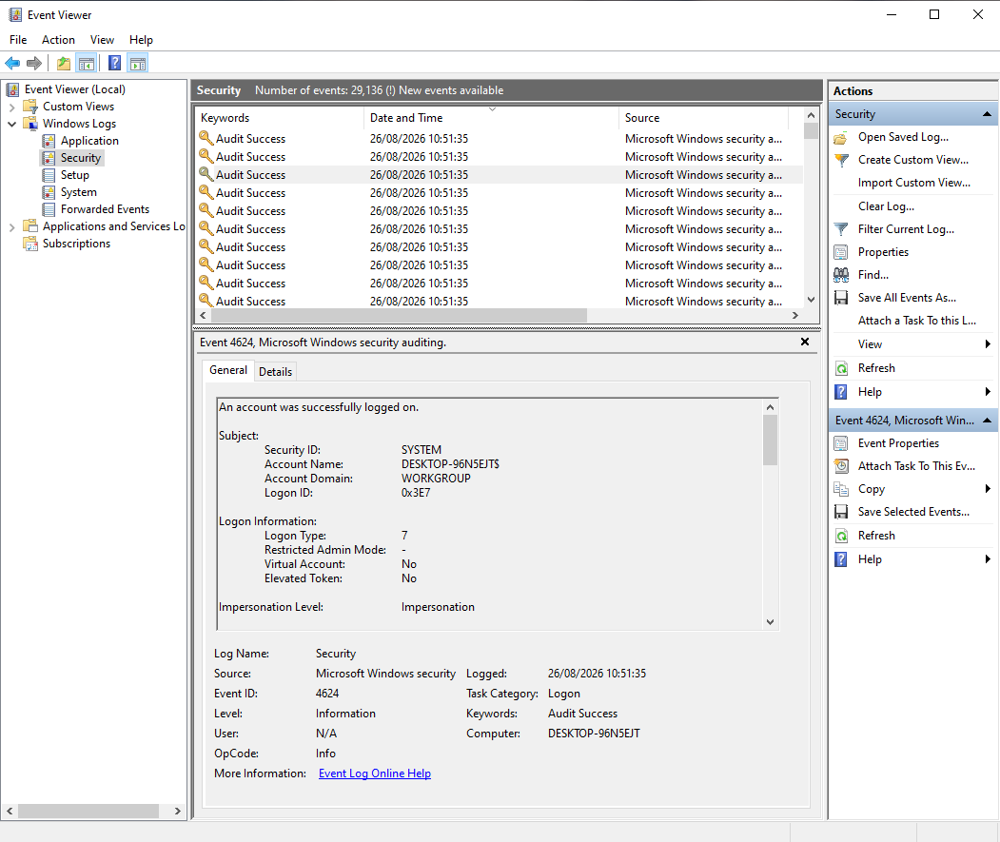
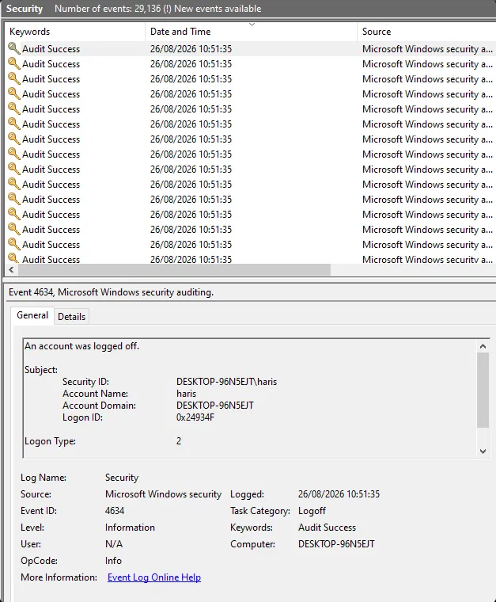

# Lab 10 – Windows Event Viewer

## Objective
Learn to navigate Windows Security logs and understand what a logon
and logoff event actually contain.

## Setup
- Windows 10 client, Event Viewer (eventvwr.msc), Security log

## What I Did
Generated activity by locking and unlocking the screen, then reviewed
the resulting events in the Security log.

## Logon Event (Event ID 4624)
    Task Category: Logon
    Logon Type: 7 (Unlock)
    Subject: SYSTEM (the OS triggered the log entry)
    New Logon Account: [personal Microsoft account]
    Logon ID: 0x249F65

## Logoff Event (Event ID 4634)
    Task Category: Logoff
    Logon Type: 2
    Account Name: haris
    Logon ID: 0x24934F

## What I Learned
- Event ID is the key field — it identifies exactly what happened.
  4624 = successful logon, 4634 = logoff. Every event type has its own
  ID, and they're the vocabulary of Windows security logging.
- "Subject" and "New Logon" are different things. Subject is whatever
  triggered the log entry, and new Logon is the actual
  account whose session is starting. 
- Logon Type tells you *how* someone logged in, not just that they
  did: 2 = interactive (keyboard), 3 = network, 7 = unlock,
  10 = Remote Desktop. A Type 10 on a machine that shouldn't allow
  RDP is the kind of thing a SOC analyst would flag immediately.
- Logon ID uniquely identifies one session, and pairs a logon to its
  matching logoff. Two events close together in time aren't
  necessarily related — the Logon ID is what actually proves it.
- Even a quiet home lab machine generates tens of thousands of
  Security events. 

