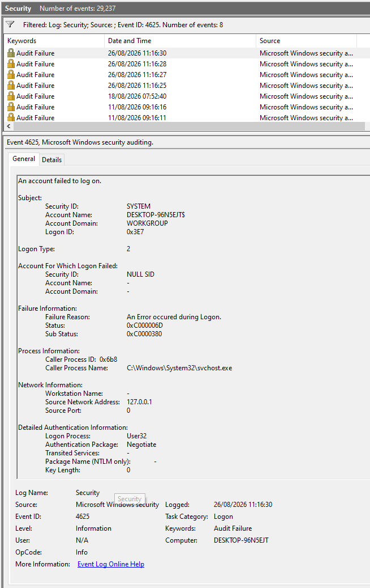
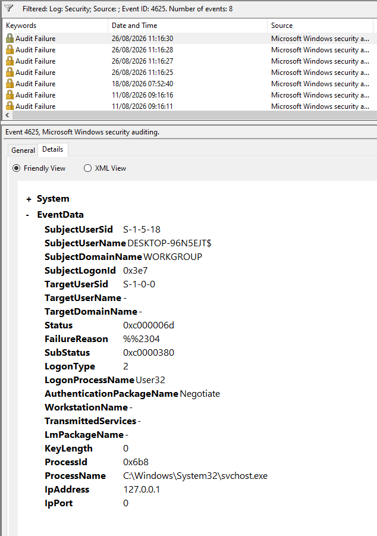

# Lab 12 – Windows Authentication Investigation

## Objective
Deliberately trigger failed logon attempts and investigate the
resulting Event ID 4625, comparing it against the successful 4624 from
Lab 11.

## Setup
- Windows 10 client, Event Viewer (eventvwr.msc), Security log
- Filtered log by Event ID 4625

## What I Did
Locked the screen and deliberately entered the wrong PIN/password
several times, then logged in correctly.

## Failed Logon Event (Event ID 4625)
    Task Category: Logon
    Logon Type: 2
    Status: 0xC000006D
    Sub Status: 0xC0000380
    Account For Which Logon Failed: TargetUserName blank, TargetUserSid S-1-0-0
    Caller Process: C:\Windows\System32\svchost.exe
    Source Network Address: 127.0.0.1

## What the Codes Actually Mean
- Status 0xC000006D is a generic "logon is invalid" code caused by bad
  credentials, and it shows up on almost every failed logon and doesn't
  say much on its own.
- Sub Status 0xC0000380 is the specific reason, and maps to
  STATUS_SMARTCARD_WRONG_PIN — an incorrect PIN was presented.
- This makes sense here: this Windows install signs in with a
  Microsoft account, which normally uses a Windows Hello PIN rather
  than a typed password. Windows routes PIN verification through the
  same authentication code path as smart cards, even with no physical
  card involved — so a wrong PIN is logged with a smart-card-style
  code.
- TargetUserName was blank, and TargetUserSid was the generic
  "no identity" SID (S-1-0-0) — consistent with the failure happening
  before Windows resolved a specific account, which lines up with a
  PIN check failing early.

## What I Learned
- Status and Sub Status are two different levels of detail. Status is
  almost always the same generic code; Sub Status is where the real
  answer lives.
- The same-looking "failed login" can leave very different log
  signatures depending on the authentication method used (typed
  password vs PIN vs smart card)
