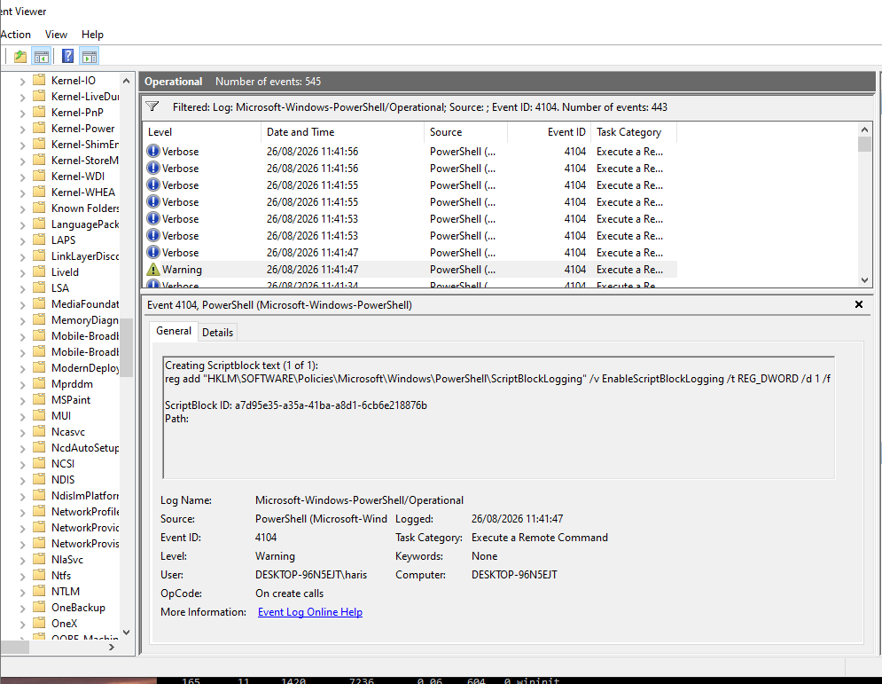

# Lab 12 – Windows PowerShell Investigation

## Objective
Understand PowerShell logging: what's recorded by default, how to turn
on more detailed logging, and how Windows automatically flags
suspicious activity.

## Setup
- Windows 10 client, Event Viewer
- Default log: Applications and Services Logs > Windows PowerShell
- Detailed log: Applications and Services Logs > Microsoft > Windows >
  PowerShell > Operational

## What I Did
1. Checked the default PowerShell log (no setup needed) — saw basic
   engine/provider start events (400, 600).
2. Enabled Script Block Logging:
       reg add "HKLM\SOFTWARE\Policies\Microsoft\Windows\PowerShell\ScriptBlockLogging"
       /v EnableScriptBlockLogging /t REG_DWORD /d 1 /f
4. Ran a normal command (Get-Process) and an encoded command
   (powershell -EncodedCommand ...) to compare.
5. Reviewed the detailed log, Event ID 4104.

## Key Finding
Filtering on Event ID 4104 returned 443 events from just two test
commands — script block logging captures everything running in the
shell, including PowerShell's own internal housekeeping (e.g. the
`prompt` function firing on every new line), not just what a person
typed. Filtering by log level cuts through this noise fast.

One event stood out at **Warning** level instead of the usual
Verbose:
    Creating ScriptBlock text (1 of 1):
    reg add "HKLM\SOFTWARE\Policies\Microsoft\Windows\PowerShell\ScriptBlockLogging" 
    /v EnableScriptBlockLogging /t REG_DWORD /d 1 /f

PowerShell has a built-in list of suspicious patterns
independent of whether full script block logging is even enabled
and any script block matching one is automatically logged at Warning
level. Commands that touch security-related registry keys fall
into that category, because tampering with logging configuration is a
well-known technique attackers use to cover their tracks (MITRE
ATT&CK calls this "Impair Defences").

## What I Learned
- Script block logging (Event ID 4104) records the actual PowerShell
  code that ran, and this is what makes it
  useful against obfuscated/fileless attacks.
- High log volume is normal and expected; filtering by level (Warning
  vs Verbose) is the practical way to find what matters.
- Windows auto-flags certain commands as suspicious regardless of
  configuration — including commands that modify security/logging
  registry settings, since that's a common defence-evasion technique.
