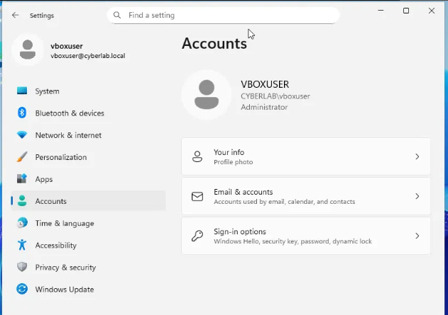
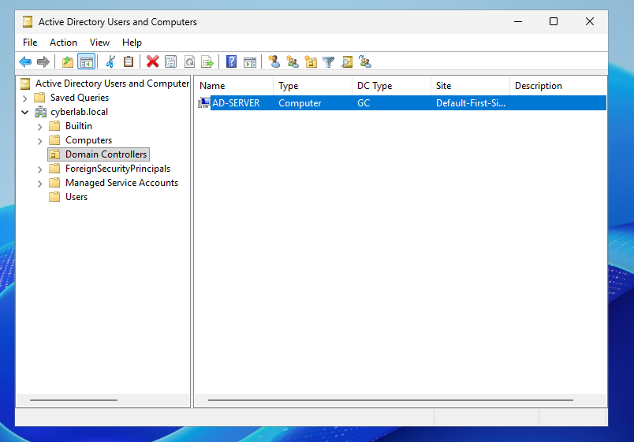
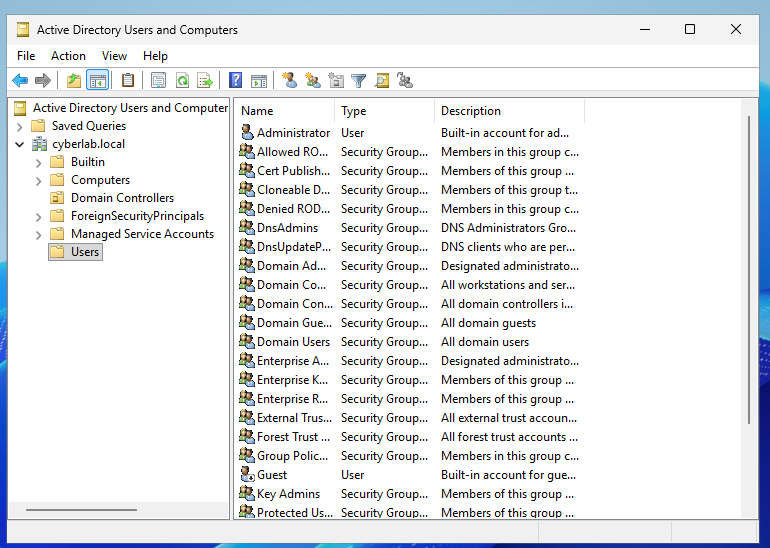

# Lab 13 – Build an Active Directory Domain

## Objective
Stand up a Windows Server domain controller and create a new Active
Directory forest/domain from scratch.

## Setup
- AD-Server: Windows Server 2025 Standard Evaluation (Desktop
  Experience), 4GB RAM, 2 CPUs, 60GB disk
- Static IP: 10.10.10.2, gateway 10.10.10.1, on the same internal
  network as Kali and the Windows 10 client
- Domain created: cyberlab.local (NetBIOS: CYBERLAB)

## Troubleshooting

**Inbound ping blocked by default**
Windows Server blocks incoming ICMP out of the box, same as Windows 10
did back in Lab 9. Fixed with:

    Enable-NetFirewallRule -DisplayName "File and Printer Sharing (Echo Request - ICMPv4-In)"

## What I Did
1. Installed the Active Directory Domain Services (AD DS) role via
   Server Manager.
2. Promoted the server to a domain controller, choosing "Add a new
   forest" with root domain name cyberlab.local.
3. Set a DSRM (Directory Services Restore Mode) password — a separate
   recovery-only password, distinct from the domain Administrator
   password.
4. Let the server reboot to complete the promotion.

## Verification
Logged back in as CYBERLAB\vboxuser and opened Active Directory Users and Computers
(dsa.msc)

**Domain Controllers** container shows AD-SERVER registered as a
  domain controller.
  

**Users** container shows the full set of default security groups
  (Domain Admins, Enterprise Admins, Domain Users, etc.) plus the
  built-in Administrator and Guest accounts.

## What I Learned
- Promoting a server to a domain controller needs full local
  administrator rights, and being "an admin" isn't always the same thing
  as having full rights, especially with auto-created accounts from
  unattended installs.
- The account used to create a new forest automatically becomes a
  Domain Admin.
- Several Windows defaults (blocked inbound ping, disabled built-in
  Administrator account) exist for good security reasons, but
  routinely get in the way of lab/testing work — worth knowing they're
  defaults, not bugs.
