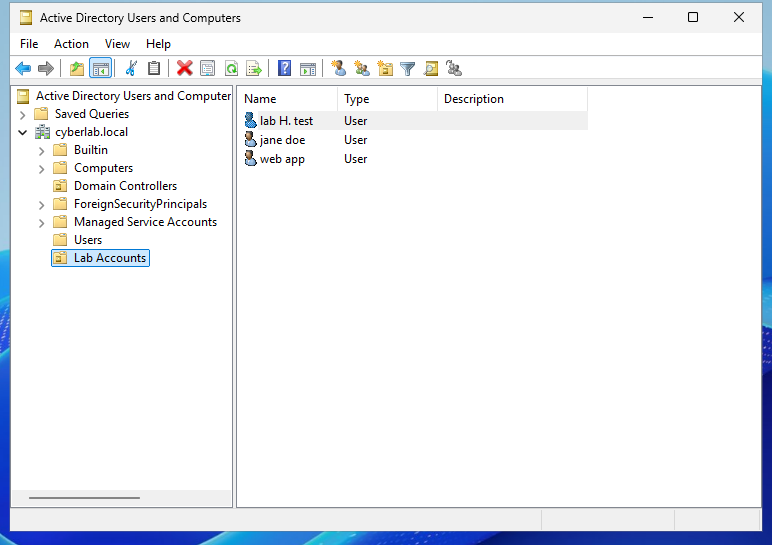

# Lab 14 – Active Directory Users & Groups

## Objective
Create the three common account types in Active Directory — an admin
account, a standard user, and a service account — and understand why
each is configured differently.

## Setup
- Domain: cyberlab.local
- Created an OU called "Lab Accounts" to keep these organised

## What I Did
Created three user accounts in the Lab Accounts OU:

**Admin account**
- Added to the Domain Admins group
- "User must change password at next logon" left checked
- Replaces vboxuser as the account used for admin tasks going forward

**Standard user account (jane doe)**
- No group memberships beyond the default Domain Users
- Represents a normal employee account with no special rights

**Service account (web app)**
- "User must change password at next logon" unchecked
- "Password never expires" checked
- No group memberships — only the specific access it needs should
  ever be granted, nothing broader

## Verification
Confirmed via the admin account's Properties > Member Of tab:

    Domain Admins    cyberlab.local/Users
    Domain Users     cyberlab.local/Users

All three accounts visible in the Lab Accounts OU.

## What I Learned
- Domain Admins and Domain Users aren't mutually exclusive — every
  account keeps Domain Users as its primary group even after being
  added to Domain Admins.
- Admin and service accounts should be visually distinguishable from
  regular users at a glance (naming conventions like a .admin suffix
  or svc- prefix exist specifically for this).
- Service accounts and standard users get different password settings
  on purpose: a person can respond to "change your password," a piece
  of software cannot — so service accounts use "password never
  expires" instead.
- Least privilege in practice: an account should only get the access
  it specifically needs. A service account with Domain Admin rights
  it doesn't need is a real, common security risk in production
  environments, not just a lab technicality.
